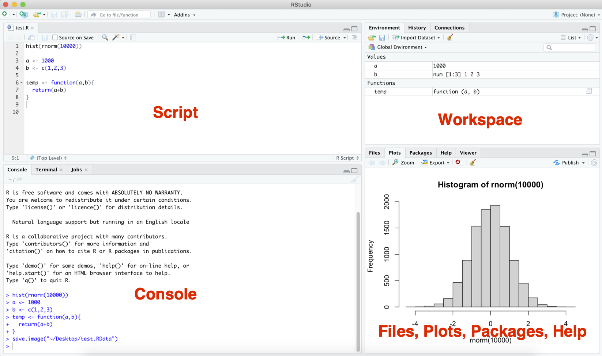

# R and RStudio set up

## Instructions
This tutorial is aiming to introduce you to R and RStudio. It will guide you to download and install R and RStudio and walk you through the main components in RStudio. Follow this tutorial step-by-step and finish setting up R and RStudio before the next tutorial.

Accompanying this tutorial is **a short [Google quiz](https://forms.gle/Xf1AfoGaxhwrWRQ38)** for your own self-assessment. The instructions of this tutorial will clearly indicate when you should answer which question.

## Learning Objectives

* Understand the difference between R and RStudio

* Download and install R

* Download and install RStudio

* Be familiar with the main components in RStudio

## What is R?

R is a language and enviroment for statistical computing and graphics. It is commonly used in borh academia and industry. 

It is:

* Free and open source

* Easy to learn and use

* Good compatibility - can be used in Windows, macOS, and Linux

For more information about R, check out this [website](https://www.r-project.org/about.html).

#### **DO QUESTION 1 OF THE QUIZ NOW** {-}

* R is a programming language. (True or False)

## What is RStudio?

RStudio is not a language - is an IDE (Integrated Development Environment) for R. It hae two versions available: RStudio desktop and RStudio Server. We will use RStudio desktop in this tutorial.

There are lots of available IDEs for R. The reason why we chooes RStudio is that it has a fancy GUI and required features that makes working with R much easier and more efficient. 

#### **DO QUESTION 2 OF THE QUIZ NOW** {-}

* True of False: RStudio is a programming language which is similar to R

## Download and Install R

* Go to https://www.r-project.org/ and click on **download R**

* Choose CRAN location based on your geological location

* Download R based on your operating system and choose the latest release version (it is Python 3.9.5 for now)

* Open the downloaded package and follow the instruction there to finish the installation

## Download and Install RStudio

**Make sure you downloaded and installed R before doing the following steps**

* Go to https://www.rstudio.com/products/rstudio/download/ and download the RStudio Desktop

* Open the downloaded file and follow the instruction there to finish the installation

## RStudio Basics

RStudio has 4 main components:

* Script (top left)

    * The Script is where you write the R code
    
    * You can save the script as a `.R` file
    
* Console (bottom left)

    * The console is where the R code being executed
    
    * Output (except graphs and plots) will be shown after code executed

* Workspace (top right)

    * All objects in the current working environments including variables, data, and functions are listed here with a brief display of their corresponding values.
    
    * You can import other workspaces, save the current workspace, and clean up the current workspace
    
    * R workspace file ends with `.RData`

* Files, Plots, Packages, Help (bottom right)
 
     * Files is the place to view the Files and to set Working Directory
     
     * Plots gives a preview of plot - it is the place where graphical output will be displayed
     
     * Packages is the place to install/view/update packages
     
     * Help is the place to get help about R

#### **DO QUESTIONS 3-11 OF THE QUIZ NOW** {-}

* In RStudio, where do you write your R code if you don't want it be saved? 

* In RStudio, where do you write your R code if you do want it be saved? 

* What type is the saved R code file? 

* In RStudio, where is your R code executed?

* In RStudio, where is numerical output displayed?

* In RStudio, where is graphical output displayed?

* In RStudio, where are variables, data, functions stored?

* What type is the workspace file? 

* Is there a way to find the details about functions and packages in RStudio?

## Summary and Takeaways
By the end of this tutorial, you should be able to set up R and RStudio successfully. Please feel free to reach out if you have any issues with the set ups.

Before we proceed to the next tutorial, make sure that you're familiar with the RStudio GUI and features. 

