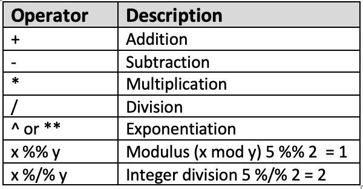
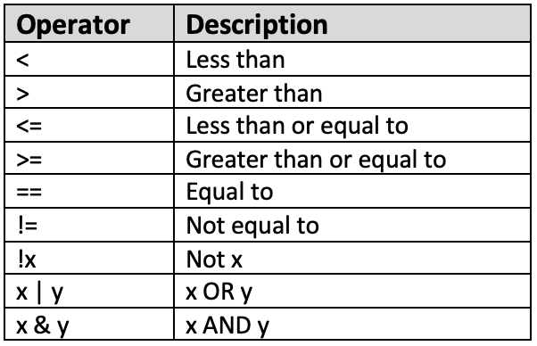
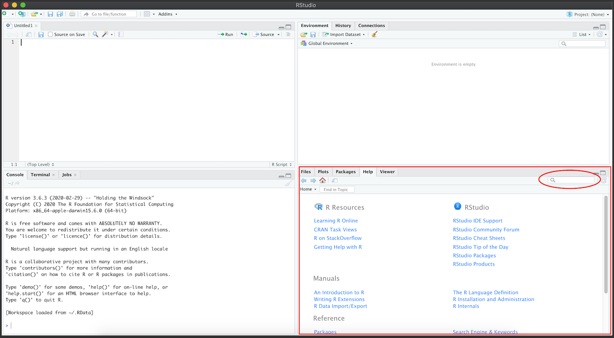

# Introduction to R

<iframe width="560" height="315" src="https://www.youtube.com/embed/4nsW4Q3S6FE" title="YouTube video player" frameborder="0" allow="accelerometer; autoplay; clipboard-write; encrypted-media; gyroscope; picture-in-picture" allowfullscreen></iframe>

<iframe width="560" height="315" src="https://www.youtube.com/embed/g7yZB7yi4bw" title="YouTube video player" frameborder="0" allow="accelerometer; autoplay; clipboard-write; encrypted-media; gyroscope; picture-in-picture" allowfullscreen></iframe>

<iframe width="560" height="315" src="https://www.youtube.com/embed/kmYB62yyTKk" title="YouTube video player" frameborder="0" allow="accelerometer; autoplay; clipboard-write; encrypted-media; gyroscope; picture-in-picture" allowfullscreen></iframe>


## Instructions
This tutorial will introduce you to the basics of the language of R. We will cover how to set up our working environment, mathematical and logical operators, the most common data types in R, explore a simple dataset, write an R function as well as how to seek for help within and outside of R.

Accompanying this tutorial is **a short [Google quiz](https://forms.gle/P5x4pRK39xrA9EJR9)** for your own self-assessment. The instructions of this tutorial will clearly indicate when you should answer which question.

## Learning Objectives
* Be familiar with the basic procedures for setting up an R session with functions such as `getwd()`, `setwd()`, `dir()`, `install.packages()`, and `library()`.
* Understand the very basic of how and when to use arithmetic and logical operators in R.
* Be familiar with the most common types of data in R including string, vector, data frame, and list.
* Explore a dataset using basic Base R functions.
* Know how to write a new function in R.
* Be comfortable with and know how to seek for help within and outside of R.

## Set Up Basics

### Working Directory

One of the most important function in R is `getwd()`, or "get working directory". The output of this code is the pathway of your current R file. Interestingly, `getwd()` does not have any argument. In other words, you do not have to type anything in the `()`.

It is highly recommended that all of your files (the R file, any data files, images, etc) be in the same directory. This will make your project much more organized and your life a lot easier when we get into more complicated data analysis that involves more data files.

By default, your working directory is whatever folder your current R file is in.

```{r}
getwd()
```

If at any point, you want to change your working directory to another folder, you can use `setwd()`. Different from `getwd()`, `setwd()` requires an argument within its brackets. To set a new working directory, you need to copy and paste the pathway within the brackets and in quotation marks ("").

This code is helpful when you need to pull files outside of the default working directory. However, you should be mindful when using this function because it gets very confusing very quickly.

```{r}
#setwd("")
```

Another important function is `dir()`. This function lets you check all of the files that exist in your working directory.

This function is a good option if you want to check if there are any extra or missing files from your working directory.

```{r}
dir()
```

You will see that there are 2 CSV files in our working directory: last_15_bpx.csv and last_15_demo.csv. Do not worry about what they are right now (we will cover this in later tutorials). All you have to know for now is that these two files are currently residing in our input/tutorial-demo folder, AKA our working directory.

The example above is only to demonstrate how we would change our working directory. But since we want to remain in our default working directory for the rest of this tutorial, we will set our working directory back to the original directory.

```{r}
setwd("..") # this ".." argument allows us to move back 1 folder

#setwd("") # and then we can set our working directory back to the original by copying and pasting its pathway
```

After setting a new working directory, it is in our best interest to check the working directory again to see if we are in the right place.

```{r}
# check to see if we're back to our original directory
getwd()
```

#### Functions Debunked {-}

Throughout our tutorials, you will see a recurring section named **Functions Debunked**. These sections aim to break down the function that you were just introduced to. Each of these section will include a link for you to find more information about the function, the different arguments that can be nested within each function, and an example.

For this first section, we will debunk `#`. When you see a `#` in a code chunk, this means that the following information is a note or comment. In other words, it doesn't code for anything - it is just notes explaining what we are doing. You can try adding a `#` in front of our `getwd()` code above to see what happens!

If this doesn't make any sense to you right now, do not worry! It will make more sense as we move along the tutorials.

### Installing and Attaching Packages

Now that we understand what working directories are, we can move onto installing and attaching packages. 

There are a lot of packages on R, each has its own set of functions for different purposes. To access each set of function, we need to install the respective package. To install a package, we use `install.packages()`. Within the brackets, the only argument you need is the name of the package in quotation marks ("").

The most basic package on R is Base R. We do not actually need to install this package as it should be built into R by default. Therefore, by default, we should already have access to a range of basic R functions without having to install any packages. In this tutorial, we will only be using functions in this Base R package. However, in future tutorials, we will need to install pacakages such as dplyr and ggplot, which will give you access to even more and more advanced functions.

For the sake of demonstration, the ggplot2 package is installed below, but note that we will not be using any ggplot functions in this tutorial.

```{r}
# install.packages("ggplot2")
```

A related function is `library()`. This function is used to attach installed packages to your R session. Unlike `install.packages()` where you only need to use once, `library()` needs to be run every R session. In other words, you need to attach whatever package you need everytime to you and then reopen R.

In future tutorials, if the `library()` function does not work for you, it is most likely because you have not installed the package, and therefore need to use `install.packages()` first before `library()`.

```{r}
# another difference from install.packages() is that we do not need "" in library()
library(ggplot2)
```

To make sure the package is successfully attached, we can try running a function in that package. After running the code below, you should only see a blank square. This is correct! We will go over why this is in tutorial 5.

```{r}
ggplot()
```

#### DO QUESTIONS 1-3 OF THE QUIZ NOW {-}

* What is a "Working Directory"?

* What is the main difference between `setwd()` and `getwd()`?

* We need to install the packages first before we can load them using `library()`. (True or False)

## Arithmetic Operators

As expected from a data analysis software, you can use R like a calcultor using arithmetic operators! Here is a list of a few basic and common arithmetic operators in R:



These operators will prove themselves to be more useful in data analysis when we get to later tutorials, especially our Tutorial 4 on the dplyr package.

### [Try it yourself 2.1][2.1] {-}

a. Can you replicate and solve these problems in R?
* 2^2
* 2 × 2
* 2 + 5 × (5 ÷ 4)^6
* what is the remainder of 52 ÷ 5
* what is the whole number solution to 82 ÷ 8 

b. Can you solve for x using R?

a <- 9 + 3 * 6

x <- a ÷ 2

#### DO QUESTION 4 OF THE QUIZ NOW {-}

* The output of `10 %% 2` is equal to which of the following?

## Logical Operators

In addition, logical operators are also available on R. The main difference between arithmetic operators and logical operators is that logical operators will yield a logical (or TRUE/FALSE) output. This is a list of some common logical operators that can be used on R:



Similarly, these operators will be more useful when we learn about filtering data in future tutorials and you will also be provided with more examples then.

Here are a few example codes that you can try running:

```{r}
a <- 5 > 4 
    # the <- indicates that the information 5 > 4 is stored in the variable a - we will cover this in more detail in Section 4 of this tutorial
```

```{r}
b <- 8
b != 8
```

```{r}
a == b
```

```{r}
9 + 10 * 15 - 8 <= 103
```

```{r}
11+ 3^9 == 19694
    # note that in R, "equal to" is coded by ==, = has another meaning that you will see in section 4
```

### [Try it yourself 2.2][2.2] {-}

Translate the following into R and find the output:
* 8 times 3 is greater than 8?
* eleven divided by seven is not equal to 2?
* 9 is less than or equal to 18?

#### DO QUESTION 5 OF THE QUIZ NOW {-}

* Which of the following operators code for "equal to"?

## Most Common Data Types In R

### Strings

Strings are either single character or a collection of characters. Note that all strings are in `""`. For example:

```{r}
"hello, my name is Alex"
```

```{r}
"Where are you?"
```

```{r}
"I like to eat 6 apples"
```

### Vectors

Vector is the simplest data type in R. It is basically a list of components stored in the same place (or variable). To write a vector, starts with `c()` and input the appropriate components within the brackets. For example:

```{r}
c(1, 2, 3) # numeric
```

```{r}
c("hello", "bonjour", "ciao") # character – note that text needs to be in “”
```

```{r}
c(TRUE, FALSE, TRUE) # logical – we will cover this in more detail later
```

```{r}
c(1, "hello", TRUE) # mixed
```

We can also store these vectors using the symbol `<-`. 

**Note:** If you are using RStudio, they will be stored in our environment located in the top right window.

```{r}
numeric <- c(1, 2, 3, 10:12) # 10:12 means 10, 11, 12!
```

```{r}
character <- c("hello", "bonjour", "ciao")
```

```{r}
logical <- c(TRUE, FALSE, TRUE)
```

What we just did was assigning values to variables where numeric, character, and logical are all variables!

### [Try it yourself 2.3][2.3] {-}

Can you try storing a string? Assign the string "hello world, I am here" to the variable named start. 

**Note how the string is in "" but the variable name is not. Why do you think this is?**

After assigning values to our variables, we can tell R to retrieve them by typing any of these variable names. R will give us the components of data that we assigned to each variable as the output.

```{r}
numeric
```

```{r}
character
```

```{r}
logical
```

If you want to extract a particular component from a variable, you can use `[]`. For example:

```{r}
numeric[1:4] # the first 4 components
```

```{r}
character[2] # only the 2nd component
```

### [Try it yourself 2.4][2.4] {-}

It is important to note that **R is case-sensitive**. This means that it distinguishes capitalized from non-capitalized characters, so logical and Logical are read as two separate things by R!

Try typing Logical with a capitalized "L". How does R respond to this?

We can also replace `<-` with `=` when assigning values to variables. But `=` has other uses as well - you will be introduced to their slight differences in future tutorials. Also, note that in R, `=` does not mean "equal to". As you have see in the previous section, "equal to" is coded by `==`.

### Lists

A list is a collection of possibly unrelated components. It allows you to gather different types of data into one place. In the code below, we have numbers, characters, and data frame all in one place.

```{r}
list <- list(numeric = 1, character = c("bonjour", "hello"), "I like to eat 6 apples")
```

Similarly, you can also extract specific information from this list using `[]`. Note that in the code below, the output is "bonjour" AND "hello", this is because the second component of our list is a vector that houses both of these words.

```{r}
list[2]
```

#### Functions Debunked {-}

The arguments for [list()](https://www.rdocumentation.org/packages/base/versions/3.6.2/topics/list) are as follows:

list(**Variable name of any data type** = **Any data stored within that variable** OR **Any string**)

**For example:** `list(numeric = 1, character = c("bonjour", "hello"), dataframe = logical)`

### Dataframe

Dataframe, you guessed it, stores your data in the form of a dataframe or a table! Dataframe allows you to store multiple vectors into one single table.

```{r}
dataframe <- data.frame(numeric, character, logical)
```

```{r}
dataframe
```

#### Functions debunked {-}

The arguments for [data.frame()](https://www.rdocumentation.org/packages/base/versions/3.6.2/topics/data.frame) are as follows:

data.frame(**Vector 1**, **Vector 2**, **Vector n**)

**For example:** `dataframe <- data.frame(numeric, character, logical)`

If you want to change the column names of your data frame, you can use the function `names()`.

```{r}
names(dataframe) <- c("Number", "Text", "T/F")
```

Now if we check our data frame again, the new column names should appear.

```{r}
dataframe
```

#### Functions Debunked {-}

The arguments for [names()](https://www.rdocumentation.org/packages/base/versions/3.6.2/topics/names) are as follows:

names(**Name of Dataset**) <- **A vector of components which length matches with that of the dataset** (we will go over length in section 5 of this tutorial)

**For example:** `names(dataframe) <- c("Number", "Text", "T/F")`

### [Try it yourself 2.5][2.5] {-}

Why do you think numeric, character, and logical are not in "" but Number, Text, and T/F are?

Similar to how we extracted information from vectors and lists, we can also use `[]` to extract certain rows, columns, or cells in a data frame.

```{r}
dataframe[1, ] # only fhe first row
```

```{r}
dataframe[, 2] # only the second column
```

```{r}
dataframe[3, 2] # only cell (3,2) - the third row and second column
```

#### DO QUESTIONS 6 & 7 OF THE QUIZ NOW {-}

* Which of the following codes would extract only rows 1, 3, 6 and only column 1 from our data frame?

* What is the value of the cell in the first row and third column of our data frame?

We can also add a new column to our data frame using the function `cbind()` like below. Note how the column name is in `""`. It is also important that the new column has the same number of values as the rest of the columns. If the new column contains less values than the other columns, you can use `NA`, or "not available" values, to fill up the rest of the places!

```{r}
new_column <- cbind(dataframe, "new column" = c(2, 3, 4, 5, 1, NA))
    # we will learn more about NA values in tutorial 4
```

Similarly, the function to add a new row is `rbind()`. The two functions work almost identical, but `rbind()` does not require a row name.

```{r}
(new_row <- rbind(new_column, c(13, "hello", FALSE, NA)))
```

You may have noticed that the code above has an extra `()` that encompasses the whole code. This `()` is another way for us to print the output of our function - it is equivalent to if we just run the name of data frame new_row. Try removing the extra `()` and see what happens!

#### Functions Debunked {-}

**[cbind()](https://www.rdocumentation.org/packages/base/versions/3.6.2/topics/cbind)** is used to create new columns in a data frame. The arguments are as follows:

cbind(**the Current Data Frame**, "**Name of the New Column**" = **Value(s) in the New Column**)

**[rbind](https://www.rdocumentation.org/packages/SparkR/versions/2.4.6/topics/rbind)** is used to create new rows in a data frame. The arguments are as follows:

rbind(**the Current Data Frame**, **Values in the New Row**)

There exists many other types of [data types](https://www.statmethods.net/input/datatypes.html) on R, you are free to explore them on your own time. But what we have been introduced to are the most basic ones.

## Exploring a Dataset

Now that you are familiar with the different data types and operators of R, we can move on to the fun parts of this tutorial: exploring a dataset!

To introduce you to the concept of exploring data on R, we will be using a dataset already available on R - in other words, we will not be importing data into R yet, we will cover this in another tutorial. Conveniently, R has a set of built-in datasets that we can use to practice using basic R functions. In this tutorial, we will use the dataset named "faithful" which contains information on the Old Faithful Geyser in Yellowstone National Park. Run the codes below to explore the dataset.

```{r}
# information on the data
# ?faithful
```

```{r}
# the actual data
# faithful
# print(faithful)
```

#### Functions Debunked
**[print()](https://www.rdocumentation.org/packages/base/versions/3.6.2/topics/print)** is another option for you to use if you want to see a variable, dataset, or any other type of output.

print(**Any Object**)

**For example:** `print(faithful)`, `print(faithful$eruptions)`, `print(1:12)`

### [Try it yourself 2.6][2.6] {-}

1. What are 2 ways that we can print rows 1 to 5 of the data frame faithful?
2. What is the value of the cell in the fourth row and second column of the data frame faithful?

### Dimensions

Usually, the first thing we want to do when exploring a dataset is to check its dimensions. To do this, we use the function `dim()` with the dataset name between the `()`.

```{r}
dim(faithful)
```

You should see two numbers as the output: 272 and 2. This tells us that the dataset faithful has 272 rows (AKA observations) and 2 columns (AKA variables). Checking the dimensions of our datasets may be helpful when we want to check how large our dataset is after a certain data manipulation method. This may also be helpful to check if our manipulated or original data is abnormally large or small.

### Structure

We can also check the structure of our data using the function `str()` with the dataset name between the `()`.

```{r}
str(faithful)
```

In this case, we are provided with several pieces of information:
1. the dataset faithful is a data frame
2. there are two columns, or variables, in this dataset: eruptions and waiting
3. both eruptions and waiting contain numerical data

As you can see, `str()` can be very helpful if we want to check what kind of data we are working with and how large the data is.

### Class

The class of our data can also be checked using the function `class()`. Similarly, the dataset name or the variable name can go between the `()`.

```{r}
class(faithful)
```

```{r}
class(faithful$eruptions)
```

Note how if we are checking the class of the variable eruption, we need to have the dataset name followed by a $ first before we can write the variable name.

### [Try it yourself 2.7][2.7] {-}
Write a code to find the structure of the variable waiting in the faithful dataset.

### Length

We can also check the length of our dataset or variable using `length()`. 

```{r}
length(faithful)
    ## the output should be 2 - the number of variables in our dataset!
```

```{r}
length(faithful$eruption)
    ## the output should be 272 - the number of observations in this variable!
```

### [Try it yourself 2.8][2.8] {-}

Remember those variables that we created earlier in the tutorial? Try finding the lengths of data frame and numeric. 

**Challenge:** Psst! There are actually 2 ways for you to find the length of numeric.

### Head and Tail

So we are now somewhat familiar with the basic functions to explore the general information about our dataset, YAY! If you want to check the actual dataset (AKA see the actual table), but do not want to see the whole data frame with 272 rows, `head()` and `tail()` are good options.

`head()` shows you the first few rows of your dataset.

```{r}
head(faithful)
```

`tail()` shows you the last few rows of your dataset.

```{r}
tail(faithful)
```

You can also choose how many rows you want to see

```{r}
head(faithful, 10)
```

```{r}
tail(faithful, 2)
```

As you can see, `head()` and `tail()` allow you to check just a portion of the dataset. This is especially useful when you’re working with large datasets and you only want to see part of it to make sure everything is okay!

#### DO QUESTION 8 OF THE QUIZ NOW {-}

* Which of the following codes is best to find how large our dataset is?

### Mathematical Functions in R

R has a range of mathemtical functions for us to use. Below are only a few basic ones, we will cover much more as we move through our tutorials. Note that these functions only work if the data class is numeric.

We can find the **mean** of waiting:

```{r}
mean(faithful$waiting)
```

We can also find the **maximum** and **minimum** values of waiting:

```{r}
max(faithful$waiting)
```

```{r}
min(faithful$waiting)
```

And the **1st, 2nd, 3rd, and 4th quantile** of waiting:

```{r}
quantile(faithful$waiting, 0.25)
```

```{r}
quantile(faithful$waiting, 0.5)
```

```{r}
quantile(faithful$waiting, 0.75)
```

```{r}
quantile(faithful$waiting, 1)
```

As well as the **median** of waiting:

```{r}
median(faithful$waiting)
```

Another powerful function in R is `summary()`. It literally summarizes everything that we have just covered in this subsection in one single table. Not only that, if you place the dataset name within the `()`, it actually runs all of the functions above for all variables in the dataset.

```{r}
summary(faithful)
```

### [Try it yourself 2.9][2.9] {-}

Recall that in order for us to refer to a variable in a dataset, we need to first type the dataset name following by a $ before we can type the variable name.

A way to avoid repeating `faithful$` everytime is to attach the dataset using `attach(faithful)`.

Try attaching the dataset faithful then find the mean of the variable eruptions without using $!

#### DO QUESTION 9 OF THE QUIZ NOW {-}

* What information does the function `summary()` provide us with? (select all that apply)

## Writing a New Function In R

While R and its existing packages has a lot to offer, there may be times when the function that we want to use does not really exist. In situations like this, we may want to just write our own function! A function in R is a script and it aims to help you to write reproducible code.

For example, we want to write a function that helps us convert temperature from Celsius to Farenheit. To do this, we would need this shell first:

```{r}
F_to_C <- function(F) {}
```

F_to_C is our function name, and `function(F)` tells R that we want to write a new function. The actual function that we write will be placed between the brackets `{}`. 

Let's think of the math really quickly. To convert °F to °C, we would need to subtract 32 then times that by 5/9. So that should look like this: `(F - 32) * 5 / 9`. And we want the function to print the results, so our final function should look like this:

```{r}
F_to_C <- function(F) {
    print((F - 32) * 5 / 9)
}
```

Each function has its own name and it is meant to be different from any other function names. To run it, you need to call the function name.

Now let's see if your function works. We can test it using a known value. Since we know that 32°F is equal to 0°C:

```{r}
F_to_C(32)
```

Awesome! It works!

Here are a few other ways that we can create new functions! Note that we can also nest existing functions inside new functions to make our own functions! For example, knowing that `sprintf()` is an existing function, we can write the following:

```{r}
hello <- function(name){
    sprintf("Hello %s", name)
}
```

```{r}
hello("Tim")
```

```{r}
hello("Elisa")
```

We can also write new functions that will give us a return statement. A return statement means you want some output or result after running the script to be returned. For example, the following function will always plus 1 to whatever number we nest between the `()`.

```{r}
plus_1 <- function(x){
    return(x+1)
}
```

```{r}
plus_1(10)
```

```{r}
plus_1(20.93)
```

Note also that there can be more than one argument in a function! For example, the following function requires the arguments x and y, of which x will be multiplied by 10 and y will be added to the new x.

```{r}
math_work <- function(x, y){
    x = x * 10
    y = y + x
    result <- list(x, y)
    return(result)
}
```

```{r}
math_work(3, 5)
```

Once we have written a new function, it will saved in your Global Environment and we can continue to use it as long as the Environment is not wiped. Note that the new functions will not work if you open a new R session that does not store them as functions. But we can also run the code chunks above again to remind R of the new functions.

## For Loops

In R, we can also write for loops that iterate a particular action/code that we want. For example, we can write a loop that adds 1 to every number of a vector. To do this, we first need to create a vector and assign it to a variable. Let's say we want the vector 1:10 to be assigned to k.

```{r}
k <- 1:10
```

After that, the for loop is written like so:

```{r}
for (i in k){
  print(k[i] + 1)
}
```

Another way for us to yield the same output is to define the vector 1:10 within the for loop directly, like so:

```{r}
for (i in 1:10){
  print(i + 1)
}
```

We can write more complicated for loops by adding more functions, arithmetic operators, or even vectors! For example, if we want to create a different for loop that calculates for the `k^2`, we should first create a new vector, k.sq, with the the same length as vector k.

```{r}
k.sq <- 1:10
```

After that, we can write our for loop like so:

```{r}
for (i in k){    
  k.sq[i] <- k[i]^2
  print(k.sq[i])
}
```

Now, everytime we call for `k.sq`, the new vector should be the output!

```{r}
k.sq
```

We can also write for loops for data frames. Let's take a look at our data frame, dataframe, again.

```{r}
dataframe
```

Now, let's say we want to loop through the entire data frame to find only the values under the "Number" column. To do that, we first need to know the number of rows our data frame has - we can use `nrow()` for this. But as we have learned before, we can just define this value directly in our for loop instead of having to do an extra step of finding the number of rows outside of the for loop. 

In other words, our code would look like so:

```{r}
for (i in 1:nrow(dataframe)){
  print(dataframe[i,"Number"])
}
```

We can also add conditions to our for loops by using `if`. For instance, we only want to print values under the "T/F" column where `i > 3`. To do that, we would need to write the following codes:

```{r}
for (i in 1:nrow(dataframe)){
  if (i > 3) print(dataframe[i,"T/F"])
}
```

## Help Within and Outside Of R

It gets a while to get used to the language of R and no tutorials can fully explain the complexities and nuances of this language. Therefore, it is important to know how to and where to get help about R! There are so many ways for you to search for help on R, here are only a few methods:

### Within R

If you have questions about a function or dataset in R, the easiest way to get help is to type ? before that particular function or dataset - as we have previously seen. Try running the codes below, what do you see?

```{r}
# ?mean
```

```{r}
# ?faithful
```

If you want to know whether there is a function for a particular action, you can use ?? before the action. If your action is more than one word long (e.g. geometric functions), you can put the entire phrase in quotation marks ("").

```{r}
# ??"geometic functions"
```

After running the code above, you should see a list of functions, the package that it belongs to, as well as what it does. For example, the function `phil()` in the R package named BAS can be usedd to compound confluent hypergeometric function of two variables.

If you are using RStudio, you can also use the search box in the help window at the bottom right corner of our screen.



### Outside of R

Outside of R, there are also plenty of resources for you to tap into [R Documentation](https://www.rdocumentation.org/) is a good starting point.

Another resource is [Stack Overflow](https://stackoverflow.com/), an online forum where you can ask and answer questions relating to coding!

#### DO QUESTION 10 OF THE QUIZ NOW {-}

* What are some of the ways that we can find help about R? (select all that apply)

## Summary and Takeaways

In this tutorial, we learned a few basic steps of using R as a data analysis language. Completing this tutorial will prepare you more advanced tutorials in the future. Learning R is like learning another language, so the biggest tip is to practice practice practice!

After this tutorial, you should be familiar with setting up for an R session using basic working directory functions. Additionally, you should also be comfortable with using arithmetic and logical operators and a few common data types of R. You are also introduced with a few basic functions for exploring a dataset as well as several common methods on how to seek help within and outside of R.

