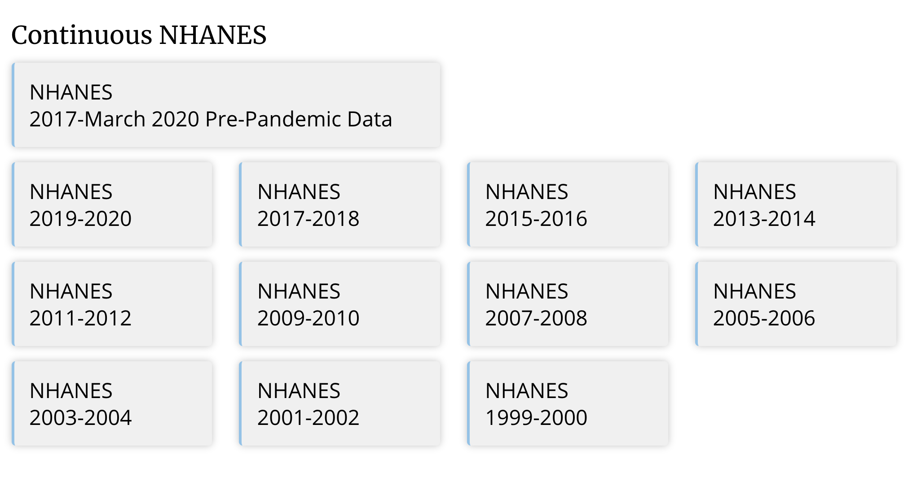
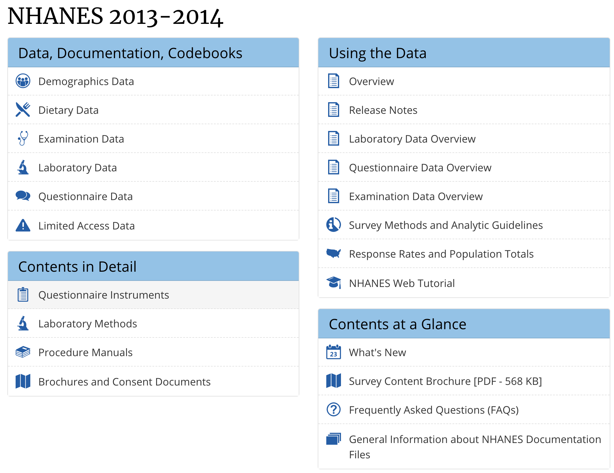
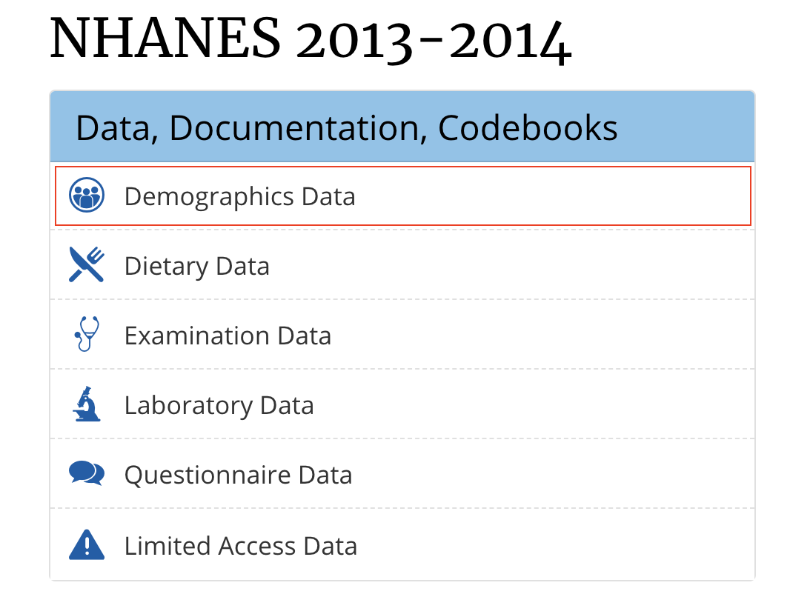
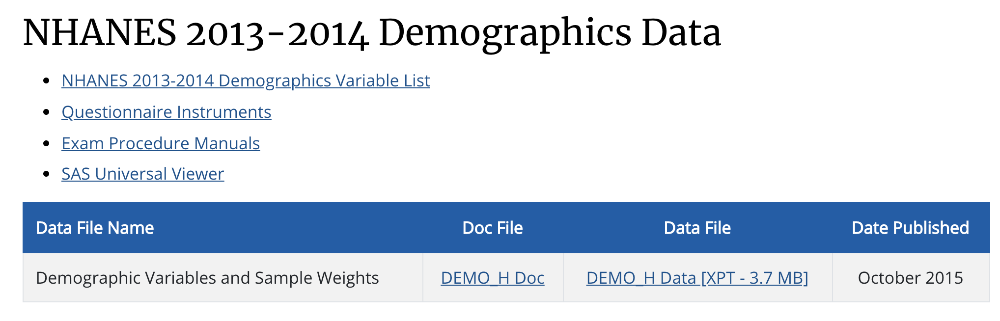

# Introduction to NHANES

## Instructions

This tutorial is aiming to provide an introduction to NHANES dataset and a guide on how to access the NHANES. It will guide you to retrieve the dataset in two days: CDC website and nhanesA package. At the end of this tutorial, it will cover some basic functions in the nhanesA package.

Accompanying this tutorial is **a short [Google quiz](https://forms.gle/zhMbsduL8xYjnmXg6)** for your own self-assessment. The instructions of this tutorial will clearly indicate when you should answer which question.

## Learning Objectives

* Be familiar with the survey data in NHANES dataset

* Be able to import NHANES dataset from CDC website

* Be able to set up the nhanesA package and import NHANES dataset from the nhanesA package

* Be familiar with the basic functions in the nhanesA package

* Be able to understand the difference between NHANES dataset and nhanesA package

## Introduction to NHANES

The National Health and Nutrition Examination Survey (NHANES) is a program with a series of studies aimed at determining the health and nutritional status of Americans, including adults and children. The NHANES program started in the early 1960s and was transformed into a countinuous program in 1999.

Started in the early 1960s, the NHANES programme has consisted of a seriess of surveys concentrating on various population groups or health themes. The survey was transformed into a continuous programme in 1999, with a shifting focus on a variety of health and nutrition measurements. For continuous NHANES,the survey is conducted in two-year cycles, i.e, 1999-2000,2001-2002,etc.

There are 5 types of continues NHANES survey data available to the public:

* Demographics Data 

* Dietary Data

* Examination Data

* Laboratory Data

* Questionnaire Data

We will focus on the continuou NHANES dataset in this series of tutorials. On this [CDC website](https://wwwn.cdc.gov/nchs/nhanes/), you will see all the continous NHANES ordered by year. 



We will use NHANES 2013-2014 just for demostration in this tutorial. If you click on NHANES 2013-2014, you will be directed to the [page](https://wwwn.cdc.gov/nchs/nhanes/continuousnhanes/default.aspx?BeginYear=2013) where you can access the data collected between 2013 and 2014:



We will introduce how to access the data in the following section.

#### **DO QUESTION 1 OF THE QUIZ NOW** {-}

* How many categories (available to public) are there in NHANES dataset?

## Importing NHANES dataset from website

Now we will learn how to download the NHANES dataset from CDC website and import it to R. In the last section, we're on this [page](https://wwwn.cdc.gov/nchs/nhanes/continuousnhanes/default.aspx?BeginYear=2013)  and we'll continue from there.

For example, we want to use the Demographics Data for further analysis. The first step is to download the dataset - click on "Demographics Data":



Then, you will see the following page:



To download the dataset, click on *DEMO_H Data [XPT - 3.7 MB]* under the *Data File*. 

To find the meanings of the variables, click on *NHANES 2013-2014 Demographics Variable List*.

Last tutorial, we learned how to import `.csv` file into R. However, the file we downloaded from CDC website is not a `.csv` file -  it is a `.xpt` file. Instead of using `read_csv()`, we need to use `read.xport()` function housed in `SASxport` package.

First, we install (if needed) and load the`SASxport` package:

```{r}
# install.packages("SASxport")
```

```{r}
library(SASxport)
```

Then, we are ready to load the datatset into R:

```{r}
demo <- read.xport("data/DEMO_H.XPT")
```

We can use the `head()` function to quickly browse the dataset:

```{r}
head(demo,5)
```

Now that we've successfully imported the dataset!

#### Functions debunked {-}

[**read.xport()**](https://www.rdocumentation.org/packages/SASxport/versions/1.7.0/topics/read.xport) is the function we use to read and load SAS XPORT file in R - it is housed in the SASxport package. The arguments are as follows: 

read.xport(**File Path**)

**For example:** `read.xport("../input/demo-h/DEMO_H.XPT")`

#### **DO QUESTION 2 OF THE QUIZ NOW** {-}

* Which package is read.xport() in?

## Importing NHANES dataset from R package: nhanesA

Another way to access the NHANES dataset is to import it from R packages. One popular R package developed for retrieving NHANES dataset is the [**nhanesA**](https://www.rdocumentation.org/packages/nhanesA/versions/0.6.5.3) package. 

As introduced before, we need to first install the `nhanesA` package from CRAN:

```{r}
# install.packages("nhanesA")
```

Second, we need to load the `nhanesA` package:

```{r}
library(nhanesA)
```

Recall that we have 5 data categories available to the public in the NHANES dataset. How do we access the data from nhanesA package?

There is a useful function called - `nhanesTables()` - list all the data files in each data category in each survey cycle  as a table. For example, if we want to see all the Demographics Data in survey cycle 2013-2014:

```{r}
nhanesTables('DEMO', 2013)
```

To see all the Examination Data in survey cycle 2015-2016:

```{r}
nhanesTables('EXAM', 2015)
```

To see all the Dietary Data in survey cycle 2014-2015:

```{r}
nhanesTables('DIETARY', 2014)
```

#### Functions debunked {-}

[**nhanesTables()**](https://www.rdocumentation.org/packages/nhanesA/versions/0.6.5.3/topics/nhanesTables) is the function we use to display the data in a table format - it is housed in the nhanesA package. The arguments are as follows: 

nhanesTables(**'Data Category'**, **Year**)

**Note**:Abbreviation for the data category in the first argument is listed below:

* Demographics Data = DEMO

* Dietary Data = DIETARY

* Examination Data = EXAM

* Labortary Data = LAB

* Questionnaire Data = Q

**For example:** `nhanesTables('DEMO', 2013)`

For demostration purpose, we will focus on Demographics Data in survey cycle 2013-2014 in the rest of the tutorial. 

Now that we need to access and import the dataset from `nhanesA` package. The `nhanes()` function (exactly the same as the package name) is used for importing NHANES datasets:

```{r}
demo <- nhanes('DEMO_H')
```

Browse the top 5 rows in the demo dataframe:

```{r}
head(demo,5)
```

You may get confused why we put `DEMO_H` instead of `DEMO` in the argument - recall that *DEMO* is the abbreviation for *Demographcis data*. But we also want to tell the function which survey cycle we are particularly interested in. 

Go back to the output from *nhanesTables('DEMO', 2013)* above, now we have the data file name - `DEMO_H` and `H` specifies the survey cycle 2013-2014.

As you are getting familiar with the dataset, you may notice that different letter represents different survey cycle year. For example, `H` represents survey cycle 2013-2014 and `I` represents survey cycle 2015-2016.

#### Functions debunked {-}

[**nhanes()**](https://www.rdocumentation.org/packages/nhanesA/versions/0.6.5.3/topics/nhanes) is the function we use to retrieve the dataset and return a dataframe - it is housed in the nhanesA package. The arguments are as follows: 

nhanesTranslate(**'Name of Table'**)

**For example:** `nhanes('DEMO_H')`

If you run demo alone, you will see that *RIAGENDR* (gender) is coded as 1 and 2. For ease of future use, we want to translate this 1 and 2 into male and female. 

To translate the categorical variables in NHANES, use nhanesTranslate():

```{r}
demo_translate <- nhanesTranslate('DEMO_H',
                                  c('SEQN', # Respondent sequence number
                                    'RIAGENDR'), 
                                 data = demo)
head(demo_translate,5)
```

#### Functions debunked {-}

[**nhanesTranslate()**](https://www.rdocumentation.org/packages/nhanesA/versions/0.6.5.3/topics/nhanesTranslate) is the function we use to translate variables in a dataset - it is housed in the nhanesA package. The arguments are as follows: 

nhanesTranslate(**'Name of Dataset'**, **Columns you want to be translated (can be written as a vector)**, data = **Source Data Frame**)

**For example:** `nhanesTranslate('DEMO_H', RIAGENDR, data = demo)`


### Try it yourself 4.1][4.1] {-}

a. Find all the Examination Data in survey cycle 2013-2014.

b. Import the blood pressure dataset in the Examination Data in survey cycle 2013-2014

c. Translate the following variables in the BPX dataset

    * BPXPULS - Pulse regular or irregular?
 
    * BPAARM - Arm selected

#### **DO QUESTIONS 3-5 OF THE QUIZ NOW** {-}

Fill in the blank to answer the 'Try it yourself' sections:

* nhanesTables(`___`,`___`)

* bpx <- nhanes(`___`)

* bpx_translate <- nhanesTranslate(`___`, c('BPXPULS', 'BPAARM'), data = `___`)

### Other packages in R

There are other packages that are developed as a tool to retrieve and analyze the NHANES dataset, such as `RNHANES` package. You are encouraged to explore packages beside `nhanesA` and play with the data. However, we will be using `nhanesA` for this series of tutorials, so it is important that you're familiar with it before we move on.

### Alternative ways to download NHANES

If you are wondering how the `nhanes()` function works, here is a glimpse at what it looks like backstage. First of all, we can create our own function that does the same action as `nhanes()`. The function we are creating together is not exactly how the `nhanes()` function works, but the principles are similar. **The general gist is that we need a function that can download the .XPT file on the NHANES website and then import it into R as a data frame.**

The first step that we need to create a new function is to have a function name and the function... `function()`! Let's name our new function `downloadnhanes()`.

```{r}
downloadnhanes <- function(){
}
```

Now, our function needs arguments. Let's give it 2 arguments: the years of the dataset (ex] 2013-2014 or 2014-2015) and the dataset name (ex] DEMO_H or BPX_H).

```{r}
downloadnhanes <- function(years, prefix_suffix){
}
```

For the purpose of creating this function step-by-step, let's say that our years is 2013-2014 and our prefix_suffix is DEMO_H.

```{r}
years <- '2013-2014'
prefix_suffix <- 'DEMO_H'
```

Next, our function needs to be able to download the .XPT file straight from the NHANES website. What this means is we need our function to 
1. Know where on the web our .XPT file is and
2. Download that file

To do this, we need to create a variable that contains the .XPT's URL. If we look at the URL of an NHANES dataset's .XPT file, it should look something along this line: **https://wwwn.cdc.gov/nchs/nhanes/2013-2014/DEMO_H.XPT**. To lead R to this specific website first before we download the file, we need to use the `paste()` function like so. Note that "years" and "prefix_suffix" are written as variables because they are two arguments that we would need to define when we use this new function.

```{r}
url <- paste('https://wwwn.cdc.gov/nchs/nhanes/', years,'/', prefix_suffix, '.XPT', sep = '')
```

#### Function debunked {-}

**[paste()](https://www.journaldev.com/40396/paste-in-r)** is a function we use to combine multiple elements from multiple vectors into one single element. In this case, we are combining hard-wired characters and open variables together into one single url. Some of the main arguments are as follows:

paste(**'Text string that we want to include (note the quotation marks)'**, **A Defined Variable**, sep = **''** OR **'/'** OR **'_'** OR **'&'** etc (this argument tells R how you want each element to be separated, in our case, we don't want any separator, that's why there is nothing between the '' quotation marks))

**For example:** `paste('https://wwwn.cdc.gov/nchs/nhanes/', years,'/', prefix_suffix, '.XPT', sep = '')`

After we have our URL, we are ready to download the file! To do this, we use `download.file()` like so:

```{r}
download.file(url, tf <- tempfile(), mode = "wb")
```

There are a number of things that you can do with `download.file()`. We will not go over this function in detail, but [here](https://www.rdocumentation.org/packages/utils/versions/3.6.2/topics/download.file) is a helpful website that explains the function really well.

In the function above, we first need the URL of the file that we are downloading - in our case it is just `url` because we already defined it in the previous `paste()` function. Next, we want a place to store our downloaded file. In this case, we want it to be `tf <- tempfile()` because we want to generate a temporary storage space for our downloaded file (you can find more about `tempfile()` [here](https://www.rdocumentation.org/packages/base/versions/3.6.2/topics/tempfile)). After that, we need to use `mode = "wb"` because our .XPT file is binary. `wb` is also the most common mode type to use when we use `download.file()`.

Next, we want to import the temporary file `tf` that we create into R. To do this, we need to use `read.xport()`. We have already been introduced to the SASxport package, but an alternative to SASxport is foreign. This is another package that deals with importing different data types into R, not just .XPT.

```{r}
outdf <- foreign::read.xport(tf)
```

Finally, we want to make sure that the file we are importing is a data frame, so we need to use `data.frame()` for this.

```{r}
outdf <- data.frame(outdf)
```

Now if we combine everything that we have talked about earlier, our function should look like this:

```{r}
downloadnhanes <- function(prefix_suffix, years){
    url <- paste('https://wwwn.cdc.gov/nchs/nhanes/', years,'/', prefix_suffix, '.XPT', sep = '')
    download.file(url, tf <- tempfile(), mode = "wb")
    outdf <- foreign::read.xport(tf)
    outdf <- data.frame(outdf)
  return(outdf)
}
```

Let's see if it works!

```{r, cache=TRUE}
head(
    downloadnhanes('DEMO_H', '2013-2014')
    )
```

It works! But does it match with the output of our usual `nhanes()` function? Let's test it out.

```{r, cache=TRUE}
head(
    nhanes('DEMO_H')
    )
```

The two imported datasets are identical! Fantastic, our new function works! And that's just a sneak peak of what goes behind our `nhanes()` function.

The function that we went over in this tutorial is originally found on the CDC website. For simplification and educational purposes, the function has been simplified. You can find the original function [here](https://wwwn.cdc.gov/nchs/data/tutorials/module3_examples_R.r).


## Summary and Takeaways

By the end of this tutorial, you should be able to know what is NHANES and how to retrieve the NHANES dataset. You should also be familiar with the functions housed in nhanesA mentioned in this tutorial. 

For the next two tutorials, we will introduce two new packages - dplyr for data analysis and ggplot for data visulization. We will continusely use NHANES dataset for illustration and you'll likely be using NHANES dataset for your own research in the future. Make sure you're familiar with NHANES dataset before we move on.

